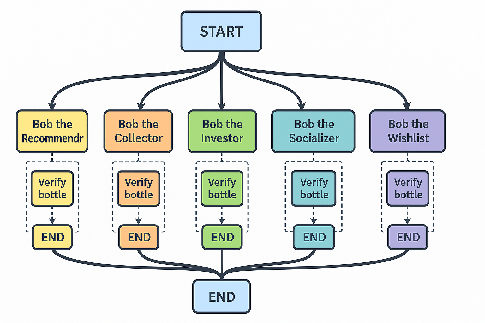

# BAXUS-Bob: Advanced Whisky Recommendation System

A multi-agent AI recommendation system for analyzing whisky collections and providing personalized bottle recommendations within the BAXUS ecosystem.

## Overview

BAXUS-Bob is an intelligent whisky recommendation platform that analyzes users' virtual bar collections to deliver tailored bottle suggestions. Unlike simple matching systems, Bob leverages a multi-agent architecture to provide comprehensive collection insights, investment advice, gap analysis, and personalized recommendations.

## Architecture

Bob employs a modular multi-agent system (using Langgraph.js) where specialized agents handle different aspects of whisky analysis and recommendation:

```
                             ┌─────────────────────────┐
                             │    Main Orchestrator   │
                             │       (Bob Core)       │
                             └───────────┬────────────┘
                                         │
     ┌───────────────────────────────────┼───────────────────────────────┐
     │                                   │                               │
┌────────────────────┐       ┌───────────────────────┐      ┌────────────────────┐
│ Bob the Recommender│       │    Bob the Investor   │      │ Bob the Collector  │
│ (Taste + Profile)  │       │ (Aging + Value Engine)│      │(Diversification+Gap)│
└────────┬───────────┘       └──────────┬────────────┘      └─────────┬──────────┘
         │                              │                             │
         │                              │                             │
┌────────────────────┐       ┌───────────────────────┐      ┌────────────────────┐
│ Bob the Socializer │       │   Bob the Pairing     │      │ Bob the Wishlist   │
│ (Community Trends) │       │  (Occasion + Food)    │      │(Wishlist Optimizer)│
└────────────────────┘       └───────────────────────┘      └────────────────────┘
```

### Agent Specializations

1. **Bob the Recommender** - Primary taste profiling and personalized bottle matching
2. **Bob the Investor** - Analysis of bottle value, investment potential, and aging insights
3. **Bob the Collector** - Collection gap analysis and diversity recommendations
4. **Bob the Socializer** - Community trend analysis and social recommendations
5. **Bob the Pairing** - Occasion and food pairing suggestions
6. **Bob the Wishlist** - Wishlist optimization and purchasing roadmap

## Features

- **Taste Profile Builder**: Creates a personalized flavor profile based on existing bottles
- **Aging & Maturation Insights**: Predicts bottle appreciation and identifies aging opportunities
- **Collection Gap Analysis**: Identifies underrepresented regions, styles, and age categories
- **Community Taste Alignment**: Compares user collections with trending bottles
- **Pairing & Occasion Recommendations**: Suggests when to drink and what to pair with bottles
- **Wishlist Optimization**: Prioritizes future purchases based on collection fit and budget
- **Advanced Ranking Engine**: Multi-dimensional scoring system for personalized recommendations

## API Response Format

```json
{
  "recommendations": {
    "top_recommendations": [
      {
        "name": "GlenDronach 18 Allardice",
        "why": "Strong match to your love for sherry-cask, rich, sweet malts.",
        "price_range": "$130–$150",
        "similar_to": ["GlenDronach 12", "Glenfarclas 15"]
      },
      {
        "name": "Lagavulin 12 Special Release",
        "why": "Expands your Islay smoky profile, complements your Laphroaig and Ardbeg.",
        "price_range": "$140–$160",
        "complements": ["Laphroaig", "Ardbeg"]
      }
    ],
    "investment_insights": {
      "hold": {
        "name": "Macallan Rare Cask",
        "current_value": "$300",
        "estimated_appreciation": "12% over next 2 years"
      },
      "recommended_buy": {
        "name": "Springbank 15",
        "reason": "Limited allocations, rising demand on secondary market"
      }
    },
    "collection_gaps": {
      "underrepresented_regions": [
        {
          "region": "American Bourbons",
          "suggested_bottle": "Blanton's Single Barrel"
        }
      ],
      "missing_age_segments": [
        {
          "age_group": "Over 20 years",
          "suggested_bottle": "Glenfiddich 21 Gran Reserva"
        }
      ]
    },
    "community_trends": {
      "popular_picks": [
        "Redbreast 12 Cask Strength",
        "Compass Box Hedonism"
      ],
      "hidden_gems": [
        "Kilkerran 12"
      ]
    },
    "pairings_and_occasions": [
      {
        "occasion": "Special Celebration",
        "recommended_bottle": "Glenfiddich 21"
      },
      {
        "food_pairing": "Blue cheese or smoked meats",
        "recommended_bottle": "Lagavulin 12"
      }
    ],
    "wishlist_prioritization": [
      {
        "name": "Balvenie 14 Caribbean Cask",
        "priority": 1,
        "reason": "Best fit, reasonable price"
      },
      {
        "name": "Nikka Coffey Malt",
        "priority": 2,
        "reason": "Diversifies flavor profile"
      }
    ]
  }
}
```

## Technical Implementation

### Agent Architecture Diagram



The multi-agent system is built using LangGraph.js (a leading framework for agentic applications) and NestJS (a progressive Node.js framework).

The application have the following modules:

- **Baxus Module**: Manages everything related to Baxus, including fetching the user’s bar history, searching for bottles that match a query from the dataset, and verifying if the recommended bottles are present in the dataset of 501 bottles.
- **Agent Module**: Handle API requests and coordinate multi-agent responses

### Below is a step by step process how these team of Agents work.

- Step 1: Request Received:
The application receives a request at the endpoint:
/agent/recommend/{username}

- Step 2: Fetch User Data:
The Baxus service fetches the user’s bar details.

- Step 3: Invoke Agent Graph:
The user’s bar history is passed to the Agent service, and the LangGraph graph is invoked.

How the multi Agent system work:

- All agents operate in parallel, independently of each other.
- Each agent analyzes the user’s bar history and performs its specialized task.
- Agents generate bottle recommendations tailored to the user’s collection.
- Agents use available tools to verify if their recommended bottles exist in the Baxus dataset of 501 bottles.
- If the recommended bottle is not found in the dataset, the agent re-iterates to suggest an alternative.
- All agent responses are then aggregated into the final API response.

## Security Considerations.

The data sent to the LLM does not include the user's personal informations such as their usernames to keep them anonymous.

## Installation & Setup

### Prerequisites

- Node.js (v20 or higher)
- npm or yarn
- Access to the BAXUS API endpoint

### Installation

1. Clone the repository:
```bash
git clone https://github.com/yourusername/agent-bob.git
cd agent-bob
```

2. Install dependencies:
```bash
npm install
```

3. Configure environment variables:
```bash
cp .env.example .env 
```
Then edit `.env` with your API keys and configuration.
Note: Use API Keys from OpenAI preferrably. An alternative is Groq (Free but highly rate-limited) 

### Running the Application

Development mode:
```bash
npm run start:dev
```

Production mode:
```bash
npm run build
npm run start:prod
```

### API Endpoint

- **GET /agent/recommend/{username}**: Get comprehensive whisky recommendations for a user

Request example 
```bash
/agent/recommend/carriebaxus
```

## Testing

```bash
# Unit tests
npm run test

# E2E tests
npm run test:e2e

# Test coverage
npm run test:cov
```

## Future Enhancements

- Integration with auction data for more accurate investment recommendations
- Caching popular bar hsitories to reduce frequent LLM API calls (increases speed and reduces cost)
- User feedback loop to improve recommendation accuracy over time
- Expanded food and occasion pairing database
- Flavor profile visualization tools
- Social sharing of recommendations
- We used the multi-agent system architecture to allow for easy integrations of future agents.

## License

This project is licensed under the MIT License - see the LICENSE file for details.

## Acknowledgments

- BAXUS for providing the API integration
- All whisky enthusiasts who provided feedback during development